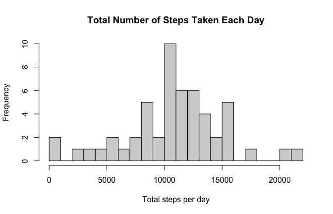
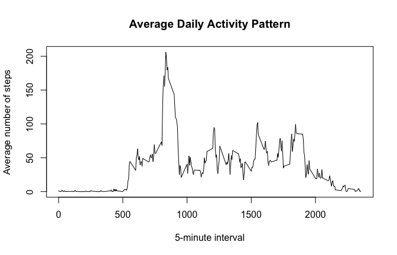
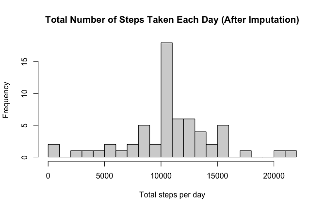

## Loading and preprocessing the data


``` r
# The dataset file is in the same folder as this Rmd
stopifnot(file.exists("activity.csv"))

activity <- read.csv("activity.csv", stringsAsFactors = FALSE)

# Convert types
activity$date <- as.Date(activity$date)          # YYYY-MM-DD
activity$interval <- as.integer(activity$interval)
activity$steps <- as.numeric(activity$steps)

# Quick sanity checks
str(activity)
```

```
## 'data.frame':	17568 obs. of  3 variables:
##  $ steps   : num  NA NA NA NA NA NA NA NA NA NA ...
##  $ date    : Date, format: "2012-10-01" "2012-10-01" ...
##  $ interval: int  0 5 10 15 20 25 30 35 40 45 ...
```

``` r
summary(activity)
```

```
##      steps             date               interval     
##  Min.   :  0.00   Min.   :2012-10-01   Min.   :   0.0  
##  1st Qu.:  0.00   1st Qu.:2012-10-16   1st Qu.: 588.8  
##  Median :  0.00   Median :2012-10-31   Median :1177.5  
##  Mean   : 37.38   Mean   :2012-10-31   Mean   :1177.5  
##  3rd Qu.: 12.00   3rd Qu.:2012-11-15   3rd Qu.:1766.2  
##  Max.   :806.00   Max.   :2012-11-30   Max.   :2355.0  
##  NA's   :2304
```

``` r
head(activity)
```

```
##   steps       date interval
## 1    NA 2012-10-01        0
## 2    NA 2012-10-01        5
## 3    NA 2012-10-01       10
## 4    NA 2012-10-01       15
## 5    NA 2012-10-01       20
## 6    NA 2012-10-01       25
```

## What is mean total number of steps taken per day?

For this part of the assignment, we ignore missing values in the dataset.


``` r
activity_no_na <- activity[!is.na(activity$steps), ]

steps_per_day <- aggregate(steps ~ date, data = activity_no_na, FUN = sum)

head(steps_per_day)
```

```
##         date steps
## 1 2012-10-02   126
## 2 2012-10-03 11352
## 3 2012-10-04 12116
## 4 2012-10-05 13294
## 5 2012-10-06 15420
## 6 2012-10-07 11015
```

``` r
summary(steps_per_day$steps)
```

```
##    Min. 1st Qu.  Median    Mean 3rd Qu.    Max. 
##      41    8841   10765   10766   13294   21194
```

### Histogram of the total number of steps taken each day


``` r
hist(
  steps_per_day$steps,
  breaks = 20,
  main = "Total Number of Steps Taken Each Day",
  xlab = "Total steps per day"
)
```

<!-- -->

### Mean and median total steps per day


``` r
mean_steps_day <- mean(steps_per_day$steps)
median_steps_day <- median(steps_per_day$steps)

mean_steps_day
```

```
## [1] 10766.19
```

``` r
median_steps_day
```

```
## [1] 10765
```

## What is the average daily activity pattern?


``` r
avg_steps_interval <- aggregate(steps ~ interval, data = activity_no_na, FUN = mean)

plot(
  avg_steps_interval$interval,
  avg_steps_interval$steps,
  type = "l",
  main = "Average Daily Activity Pattern",
  xlab = "5-minute interval",
  ylab = "Average number of steps"
)
```

<!-- -->

### Which 5-minute interval has the maximum average number of steps?


``` r
max_idx <- which.max(avg_steps_interval$steps)

max_interval <- avg_steps_interval$interval[max_idx]
max_interval_avg_steps <- avg_steps_interval$steps[max_idx]

max_interval
```

```
## [1] 835
```

``` r
max_interval_avg_steps
```

```
## [1] 206.1698
```

## Imputing missing values

### Total number of missing values in the dataset


``` r
total_missing <- sum(is.na(activity$steps))
total_missing
```

```
## [1] 2304
```

### Impute missing `steps`

**Strategy:** Replace each missing `steps` value with the **mean** for that same 5-minute `interval`
(calculated from non-missing observations).


``` r
# Mean steps per interval (ignoring NA)
mean_by_interval <- tapply(activity$steps, activity$interval, mean, na.rm = TRUE)

# Create a new dataset with imputed steps
activity_imputed <- activity
activity_imputed$steps_imputed <- activity_imputed$steps

na_rows <- is.na(activity_imputed$steps_imputed)
activity_imputed$steps_imputed[na_rows] <- mean_by_interval[as.character(activity_imputed$interval[na_rows])]

# Confirm no missing values remain in the imputed column
sum(is.na(activity_imputed$steps_imputed))
```

```
## [1] 0
```

### Histogram of total steps per day after imputation


``` r
steps_per_day_imputed <- aggregate(steps_imputed ~ date, data = activity_imputed, FUN = sum)

head(steps_per_day_imputed)
```

```
##         date steps_imputed
## 1 2012-10-01      10766.19
## 2 2012-10-02        126.00
## 3 2012-10-03      11352.00
## 4 2012-10-04      12116.00
## 5 2012-10-05      13294.00
## 6 2012-10-06      15420.00
```

``` r
summary(steps_per_day_imputed$steps_imputed)
```

```
##    Min. 1st Qu.  Median    Mean 3rd Qu.    Max. 
##      41    9819   10766   10766   12811   21194
```


``` r
hist(
  steps_per_day_imputed$steps_imputed,
  breaks = 20,
  main = "Total Number of Steps Taken Each Day (After Imputation)",
  xlab = "Total steps per day"
)
```

<!-- -->

### Mean and median after imputation + impact


``` r
mean_steps_day_imputed <- mean(steps_per_day_imputed$steps_imputed)
median_steps_day_imputed <- median(steps_per_day_imputed$steps_imputed)

mean_steps_day_imputed
```

```
## [1] 10766.19
```

``` r
median_steps_day_imputed
```

```
## [1] 10766.19
```

``` r
impact <- data.frame(
  metric = c("Mean", "Median"),
  before_impute = c(mean_steps_day, median_steps_day),
  after_impute  = c(mean_steps_day_imputed, median_steps_day_imputed),
  difference    = c(mean_steps_day_imputed - mean_steps_day,
                    median_steps_day_imputed - median_steps_day)
)

impact
```

```
##   metric before_impute after_impute difference
## 1   Mean      10766.19     10766.19   0.000000
## 2 Median      10765.00     10766.19   1.188679
```

## Are there differences in activity patterns between weekdays and weekends?

Use the **imputed** dataset for this part.


``` r
# day of week: 0 = Sunday, 6 = Saturday (locale-independent)
wday <- as.POSIXlt(activity_imputed$date)$wday

activity_imputed$day_type <- ifelse(wday %in% c(0, 6), "weekend", "weekday")
activity_imputed$day_type <- factor(activity_imputed$day_type, levels = c("weekday", "weekend"))

table(activity_imputed$day_type)
```

```
## 
## weekday weekend 
##   12960    4608
```

### Panel plot comparing weekdays vs weekends


``` r
library(lattice)

avg_interval_daytype <- aggregate(
  steps_imputed ~ interval + day_type,
  data = activity_imputed,
  FUN = mean
)

xyplot(
  steps_imputed ~ interval | day_type,
  data = avg_interval_daytype,
  type = "l",
  layout = c(1, 2),
  xlab = "5-minute interval",
  ylab = "Average number of steps",
  main = "Average Steps per Interval: Weekdays vs Weekends"
)
```

<!-- -->
