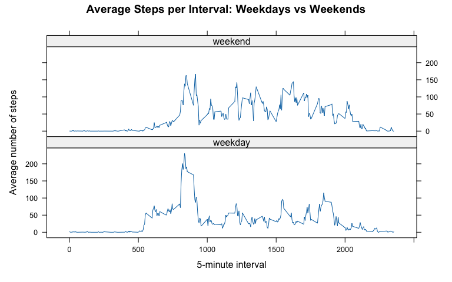

## Loading and preprocessing the data


``` r
# Per instructions: activity.csv is in the same folder and not zipped
stopifnot(file.exists("activity.csv"))

dat <- read.csv("activity.csv", stringsAsFactors = FALSE)

# Parse/convert columns
dat$date <- as.Date(dat$date)              # YYYY-MM-DD
dat$interval <- as.integer(dat$interval)
dat$steps <- as.numeric(dat$steps)

# Basic checks
str(dat)
```

```
## 'data.frame':	17568 obs. of  3 variables:
##  $ steps   : num  NA NA NA NA NA NA NA NA NA NA ...
##  $ date    : Date, format: "2012-10-01" "2012-10-01" ...
##  $ interval: int  0 5 10 15 20 25 30 35 40 45 ...
```

``` r
summary(dat)
```

```
##      steps             date               interval     
##  Min.   :  0.00   Min.   :2012-10-01   Min.   :   0.0  
##  1st Qu.:  0.00   1st Qu.:2012-10-16   1st Qu.: 588.8  
##  Median :  0.00   Median :2012-10-31   Median :1177.5  
##  Mean   : 37.38   Mean   :2012-10-31   Mean   :1177.5  
##  3rd Qu.: 12.00   3rd Qu.:2012-11-15   3rd Qu.:1766.2  
##  Max.   :806.00   Max.   :2012-11-30   Max.   :2355.0  
##  NA's   :2304
```

``` r
head(dat, 10)
```

```
##    steps       date interval
## 1     NA 2012-10-01        0
## 2     NA 2012-10-01        5
## 3     NA 2012-10-01       10
## 4     NA 2012-10-01       15
## 5     NA 2012-10-01       20
## 6     NA 2012-10-01       25
## 7     NA 2012-10-01       30
## 8     NA 2012-10-01       35
## 9     NA 2012-10-01       40
## 10    NA 2012-10-01       45
```

## What is mean total number of steps taken per day?

For this part of the assignment, missing values in `steps` are ignored.


``` r
dat_nonmissing <- dat[!is.na(dat$steps), ]

daily_totals <- aggregate(steps ~ date, data = dat_nonmissing, FUN = sum)
colnames(daily_totals) <- c("date", "total_steps")

head(daily_totals)
```

```
##         date total_steps
## 1 2012-10-02         126
## 2 2012-10-03       11352
## 3 2012-10-04       12116
## 4 2012-10-05       13294
## 5 2012-10-06       15420
## 6 2012-10-07       11015
```

``` r
summary(daily_totals$total_steps)
```

```
##    Min. 1st Qu.  Median    Mean 3rd Qu.    Max. 
##      41    8841   10765   10766   13294   21194
```

### Histogram of the total number of steps taken each day


``` r
# Different look: colored histogram with borders
hist(
  daily_totals$total_steps,
  breaks = 18,
  col = "#4C78A8",          # blue fill
  border = "white",
  main = "Distribution of Daily Step Totals (NAs Ignored)",
  xlab = "Total steps per day",
  ylab = "Frequency"
)
```


### Mean and median total steps per day


``` r
mean_daily <- mean(daily_totals$total_steps)
median_daily <- median(daily_totals$total_steps)

mean_daily
```

```
## [1] 10766.19
```

``` r
median_daily
```

```
## [1] 10765
```

## What is the average daily activity pattern?


``` r
avg_by_interval <- aggregate(steps ~ interval, data = dat_nonmissing, FUN = mean)
colnames(avg_by_interval) <- c("interval", "avg_steps")

head(avg_by_interval)
```

```
##   interval avg_steps
## 1        0 1.7169811
## 2        5 0.3396226
## 3       10 0.1320755
## 4       15 0.1509434
## 5       20 0.0754717
## 6       25 2.0943396
```

### Time series plot of average steps across all days


``` r
# Different plot style: base line + points, custom colors
plot(
  avg_by_interval$interval,
  avg_by_interval$avg_steps,
  type = "l",
  lwd = 2,
  col = "#1B9E77",          # green line
  main = "Average Steps per 5-minute Interval",
  xlab = "5-minute interval",
  ylab = "Average steps"
)
points(
  avg_by_interval$interval,
  avg_by_interval$avg_steps,
  pch = 16,
  cex = 0.4,
  col = "#1B9E77"
)
```


### 5-minute interval containing the maximum number of steps (on average)


``` r
max_row <- avg_by_interval[which.max(avg_by_interval$avg_steps), , drop = FALSE]
max_row
```

```
##     interval avg_steps
## 104      835  206.1698
```

## Imputing missing values

### Total number of missing values in the dataset


``` r
n_missing <- sum(is.na(dat$steps))
n_missing
```

```
## [1] 2304
```

### Imputation strategy and new dataset

**Strategy (different attempt):** impute missing `steps` using the **median** number of steps for the same `interval`
(calculated over all non-missing observations). This is simple and robust to spikes.


``` r
median_by_interval <- tapply(dat$steps, dat$interval, median, na.rm = TRUE)

dat_imp <- dat
dat_imp$steps_imp <- dat_imp$steps

miss_idx <- is.na(dat_imp$steps_imp)
dat_imp$steps_imp[miss_idx] <- median_by_interval[as.character(dat_imp$interval[miss_idx])]

# Confirm imputation worked
sum(is.na(dat_imp$steps_imp))
```

```
## [1] 0
```

### Histogram of daily totals after imputation


``` r
daily_totals_imp <- aggregate(steps_imp ~ date, data = dat_imp, FUN = sum)
colnames(daily_totals_imp) <- c("date", "total_steps_imp")

head(daily_totals_imp)
```

```
##         date total_steps_imp
## 1 2012-10-01            1141
## 2 2012-10-02             126
## 3 2012-10-03           11352
## 4 2012-10-04           12116
## 5 2012-10-05           13294
## 6 2012-10-06           15420
```

``` r
summary(daily_totals_imp$total_steps_imp)
```

```
##    Min. 1st Qu.  Median    Mean 3rd Qu.    Max. 
##      41    6778   10395    9504   12811   21194
```


``` r
hist(
  daily_totals_imp$total_steps_imp,
  breaks = 18,
  col = "#F58518",          # orange fill
  border = "white",
  main = "Distribution of Daily Step Totals (After Imputation)",
  xlab = "Total steps per day",
  ylab = "Frequency"
)
```


### Mean/median after imputation and comparison


``` r
mean_daily_imp <- mean(daily_totals_imp$total_steps_imp)
median_daily_imp <- median(daily_totals_imp$total_steps_imp)

mean_daily_imp
```

```
## [1] 9503.869
```

``` r
median_daily_imp
```

```
## [1] 10395
```

``` r
impact <- data.frame(
  Metric = c("Mean", "Median"),
  Before_Impute = c(mean_daily, median_daily),
  After_Impute  = c(mean_daily_imp, median_daily_imp),
  Difference    = c(mean_daily_imp - mean_daily,
                    median_daily_imp - median_daily)
)

impact
```

```
##   Metric Before_Impute After_Impute Difference
## 1   Mean      10766.19     9503.869   -1262.32
## 2 Median      10765.00    10395.000    -370.00
```

``` r
# Nicely printed table (still fully reproducible)
knitr::kable(impact, digits = 2)
```


|Metric | Before_Impute| After_Impute| Difference|
|:------|-------------:|------------:|----------:|
|Mean   |      10766.19|      9503.87|   -1262.32|
|Median |      10765.00|     10395.00|    -370.00|

## Are there differences in activity patterns between weekdays and weekends?

Use the **imputed** dataset for this section.


``` r
# Locale-independent weekday/weekend classification:
# as.POSIXlt()$wday: 0 = Sunday, ..., 6 = Saturday
wday <- as.POSIXlt(dat_imp$date)$wday

dat_imp$day_type <- ifelse(wday %in% c(0, 6), "weekend", "weekday")
dat_imp$day_type <- factor(dat_imp$day_type, levels = c("weekday", "weekend"))

table(dat_imp$day_type)
```

```
## 
## weekday weekend 
##   12960    4608
```

### Panel plot comparing average steps per interval across weekdays and weekends


``` r
avg_int_day <- aggregate(steps_imp ~ interval + day_type, data = dat_imp, FUN = mean)
colnames(avg_int_day) <- c("interval", "day_type", "avg_steps_imp")

head(avg_int_day)
```

```
##   interval day_type avg_steps_imp
## 1        0  weekday    2.02222222
## 2        5  weekday    0.40000000
## 3       10  weekday    0.15555556
## 4       15  weekday    0.17777778
## 5       20  weekday    0.08888889
## 6       25  weekday    1.31111111
```


``` r
# Different plotting system + color scheme: ggplot2 facets
library(ggplot2)

ggplot(avg_int_day, aes(x = interval, y = avg_steps_imp, color = day_type)) +
  geom_line(linewidth = 0.8) +
  facet_wrap(~ day_type, ncol = 1) +
  scale_color_manual(values = c("weekday" = "#4C78A8", "weekend" = "#E45756")) +
  labs(
    title = "Average Steps per 5-minute Interval: Weekdays vs Weekends",
    x = "5-minute interval",
    y = "Average steps (imputed dataset)",
    color = "Day type"
  ) +
  theme_minimal(base_size = 12) +
  theme(legend.position = "none")
```


